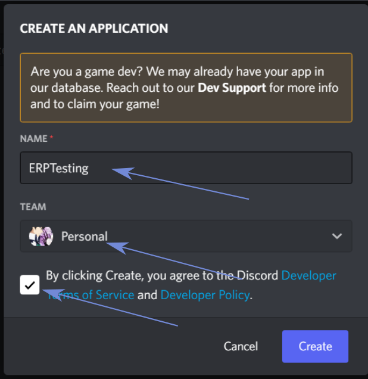

# ERP - Easy Rich Presence

  

 

Easy Rich Presence es una aplicación simple para que todo el mundo pueda configurar su propia Discord Rich Presence
a través de una bonita interfaz parecida a Discord.

_Lee esto en otros lenguajes:_
[_English_](./README.md)

## ¿Qué hace exactamente?

Buena pregunta, déjame mostrarte mi perfil:

    

¡Te permite personalizar esa sección de tu perfil!

## Cómo usarlo

While **ERP** does most of the job, it needs an app to connect to, and I'll show you how to *quickly* set it up!
A pesar de que **ERP** hace la mayoría del trabajo, necesita una aplicación a la que conectarse, ¡y te mostraré
como prepararla *rápidamente*!
 
 

    

Entra al Discord Developer Portal con este [link](https://discord.com/developers/applications) y crea una nueva aplicación
con el botón "Nueva Aplicación".
 

    

Elige el nombre de tu aplicación (este va a mostrarse en tu perfil, más sobre ello adelante), equipo (recomendado dejarlo
en "personal" si no sabes lo que estás haciendo), dale click al checkbox y finalmente otro click en Crear
 
 

    

Después de crear tu aplicación, te va a recibir esta ventana. Lo que estamos buscando es la Application ID (ni intentes
usar la ID que se muestra en la imagen porque probablemente no exista cuando leas esto), lo que vas a usar para logearte 
dentro de ERP.

Es hora de entrar a la aplicación, ¿no?

    

This is the first thing you'll see when opening the app, here you have all the options to set up the Rich Presence to your liking (more on that later). 
Something really important to take in mind is the dot next to "Connection status", a grey color means that ERP is not yet connected, while a green color 
means it is properly connected. But how do we log in?

Esto es lo primero que verás al abrir la app, aquí tienes todas las opciones para configurar la Rich Presence a tu gusto (más sobre eso adelante). 

Algo muy importante a tener en cuenta es el circulito al lado de "Connection status", un color *gris* significa que ERP todavía no está conectada, mientras que un color *verde* te dice que está conectado correctamente. Pero, ¿cómo nos logeamos?

    

Debajo de lo que te mostré antes está esta pequeña cajita que se usa, por supuesto, ¡para logearse!. Aquí debes poner la Application ID y darle click a "Log In!". Solo hay una cosa por hacer, ¡personalizar nuestra Rich Presence!

Estas semanas estuve mirando Better Call Saul (recomendadísima), ¡y quiero mostrarle al mundo que la estoy viendo!. Al principio te mostré mi perfil, que tenía una imagen chiquita y otra grande, ¿cómo hice esto? Subí las dos imágenes al Discord Developer Portal a través de la pestaña Rich Presence.

    

Los nombres de las imagenes que subas son lo que se usa en la app para actualizar tu Rich Presence. La única cosa que falta hacer es ir a la app, llenar los espacios en blanco y darle al botón "Update Presence!". Aquí un pequeño mapa de todo lo que hay que llenar y de dónde sacarlo:

    

 
"Large image text" and "Small image text" are texts shown when hovering over the image they are linked:
"Large image text" y "Small image text" son textos que se muestran cuando ponés por encima el mouse, de acuerdo con la imagen a la que estén relacionados.
 

    
    

 

And that's it! Enjoy your Easy Rich Presence!

## Ideas, sugerencias y bugs

Si tienes alguna idea, sugerencia o bug que quieras reportar contáctame a través del discord en mi [perfil](https://github.com/RakiDev).