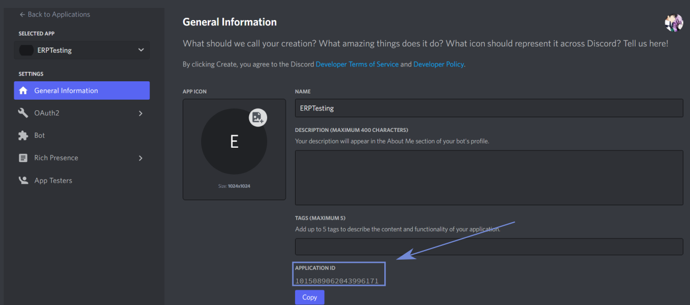
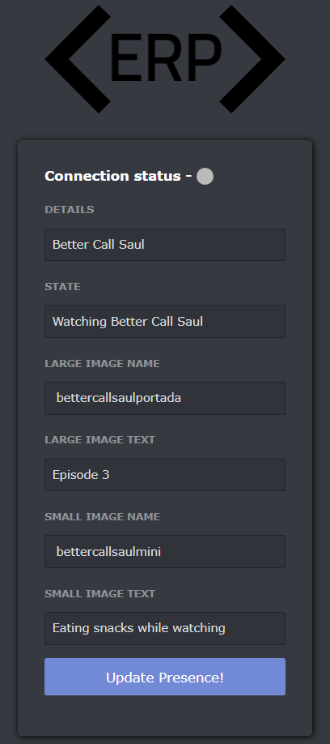
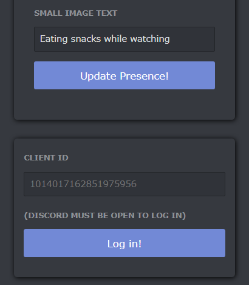
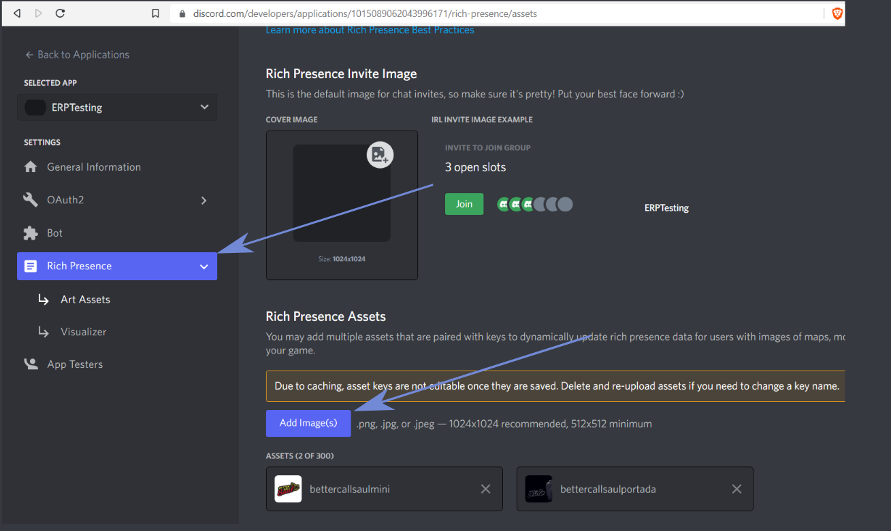
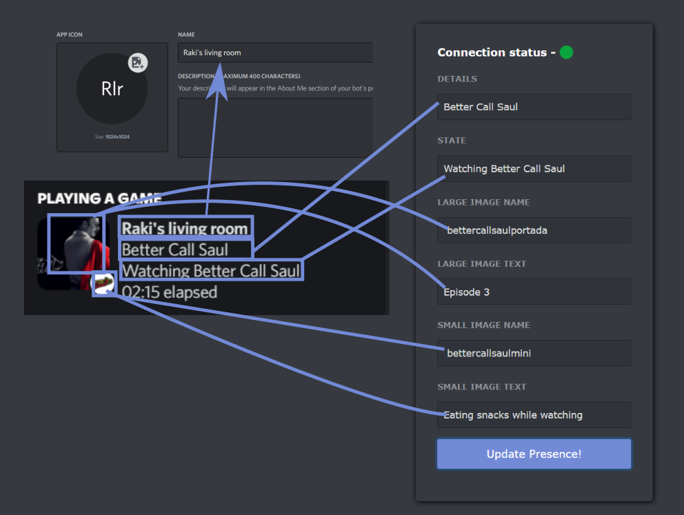

# ERP - Easy Rich Presence

  

 

Easy Rich Presence is a simple app for everyone to set their own Discord Rich Presence through a pretty and simple Discord-like UI.

_Read this in other languages:_
[_Español_](./README.es.md)

## What does it exactly do?

Good question. Allow me to show my profile:

    

It allows you to use and personalize that section of your profile!

## How to use it

While **ERP** does most of the job, it needs an app to connect to, and I'll show you how to *quickly* set it up!
 
 

    

Enter the Discord Developer Portal with this [link](https://discord.com/developers/applications) and create a new Application with 
the "New Application" button.
 

    

Choose the name of your app (this will be displayed in your profile, more on that later), team (recommended to leave it on 'personal' if you don't know what you are doing), click the checkbox and finally click on Create.
 
 

    

Upon creating your Application, you will be greeted by this window. What we are looking for is that Application ID (don't even try to
use the ID displayed in the image, by the time this is uploaded it won't exist), the thing you'll use to log in through ERP.

Let's hop on the app shall we?

    

This is the first thing you'll see when opening the app, here you have all the options to set up the Rich Presence to your liking (more on that later). 
Something really important to take in mind is the dot next to "Connection status", a *grey* color means that ERP is not yet connected, while a *green* color 
means it is properly connected. But how do we log in?

    

Below what I showed you before is this little box wich is used to, of course, log in!. Here is where you must input the Application ID and click the "Log In!" button. There's only one thing left to do, customize our Rich Presence!

I've been watching Better Call Saul the last few weeks (really recommended), and I want to show the world I'm watching it!. In the beggining I showed you my profile, wich had a little and a big picture, how did I do that? I uploaded the two images to the 
Discord Developer Portal through the Rich Presence tab.

    

The names of the images you upload are what is used in the app form to update your presence. The only thing left to do is go to the app, fill 
the blanks and hit the "Update Presence!" button. Here is a little map for where to get everything:

    

 
"Large image text" and "Small image text" are texts shown when hovering over the image they are linked:
 

    
    

 

And that's it! Enjoy your Easy Rich Presence!

## Ideas, suggestions and bugs

If you have any ideas, suggestions or bugs you want to report contact me through the Discord in my [profile](https://github.com/RakiDev).